

  

# Venturo Electronics — Performance Analysis 2022–2025

## Table of Contents
- [Client Background](#client-background)
- [Executive Summary](#executive-summary)
- [Data Structure & ERD](#data-structure--erd)
- [Insights Deep Dive](#insights-deep-dive)
- [Recommendations](#recommendations)
- [Caveats & Assumptions](#caveats--assumptions)

---

## Client Background

Venturo Electronics is a US-based direct-to-consumer electronics retailer serving a global customer base across four regions — NA, EMEA, LATAM, and APAC. Founded in 2014, the company offers a curated catalog of consumer electronic products spanning premium, mid-tier, and budget price points, distributed exclusively through digital channels. 

Venturo's customer base spans approximately 52,000 customers across 110,000+ transactions, generating $65M+ in revenue. The dataset captures key dimensions, including region, product line, marketing channel, order channel, and loyalty status, and tracks core KPIs such as revenue, average order value (AOV), order volume, customer retention, and refund rate. The business operates in a competitive, macro-sensitive environment — rising inflation, changing consumer spending habits, and growing competition from peer retailers have all shaped Venturo's performance across the four-year period.

This performance review was commissioned for the Head of Operations to comprehensively evaluate Venturo's commercial performance across 2022–2025. The findings are designed to equip internal cross-functional teams with the operational and sales intelligence needed to reduce refund rates, grow loyalty enrollment, improve regional performance, and drive sustainable revenue growth. The insights and recommendations are built around the company's most critical performance metrics and strategic levers, organized across four northstar metrics:

**North Star Metrics**

- **Sales Performance** - Revenue, Order Volume, Average Order Value (AOV) 
- **Product Performance** - Revenue Contribution by Product Line, AOV Trends, Refund Rate Analysis
- **Customer Loyalty** - Loyalty Adoption Rates, Repeat Purchase Behavior, AOV Premium, Customer Retention by Loyalty Status
- **Regional Performance** - Demand Concentration by Region, Fulfillment Performance, Product-Level Revenue Drivers

---

## Executive Summary 

Between 2022 and 2025, Venturo Electronics generated **$63.8M** in revenue across **110,000+ transactions** — moving through a post-pandemic baseline, inflation-driven slowdown, a sharp 2024 contraction, and a broad 2025 recovery. **2024** marks the clear inflection point: the only year in which revenue, average order value (AOV), and order volume declined simultaneously, by **42%**, **24%**, and **23%**, respectively. This contraction was uniform across all products, regions, and quarters, pointing to broad economic pressure as the cause rather than anything broken internally.

While the 2025 recovery was strong — revenue rebounding **56%** to **$16.3M** — performance diverged sharply by customer segment. Loyalty member sales recovered **93%** from their 2024 low versus just **39%** for non-members, with nearly double the retention rate. Two opportunities stand out heading into 2026: expand loyalty adoption — particularly in EMEA, where enrollment trails North America by **12.5** percentage points — and address APAC's delivery times, which run **171%** longer than the NA benchmark.

---

## Data Structure & ERD

The database consists of five tables — `orders`, `customers`, `date_dim`, `geo_lookup`, and `order_status`— comprising 110,542 records. `orders` serves as the central fact table, linking to `customers` via `customer_id`, fulfillment and refund data via `order_id` through `order_status`, time-series dimensions via `date_dim`, and regional classification via `geo_lookup` through `country_code`.

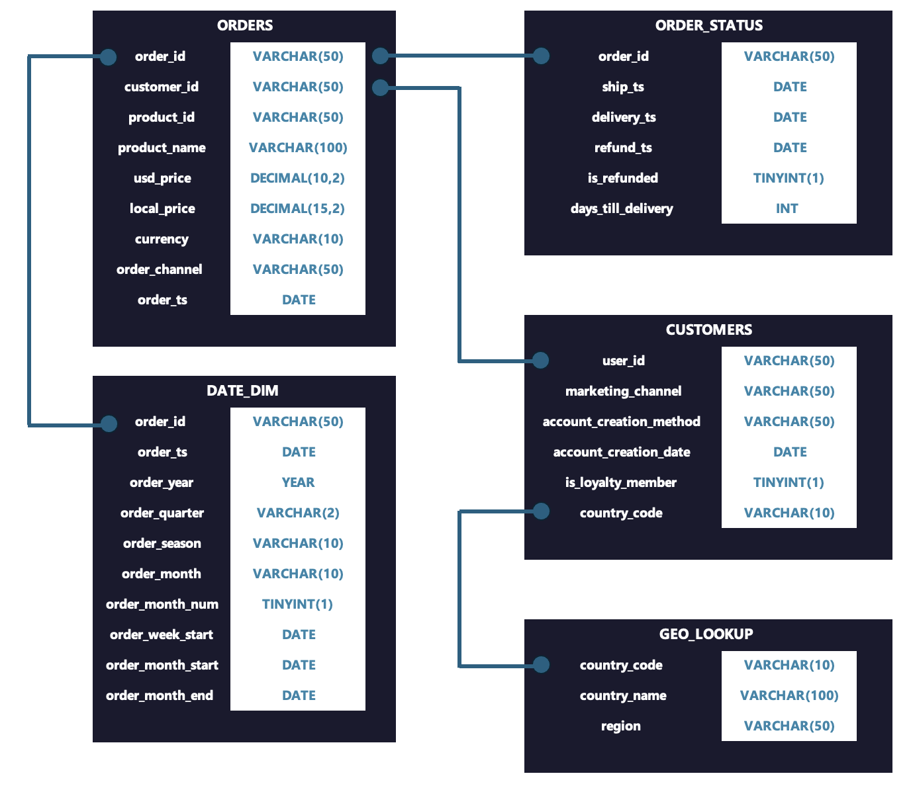

--- 

## Insights Deep Dive

### Sales Performance

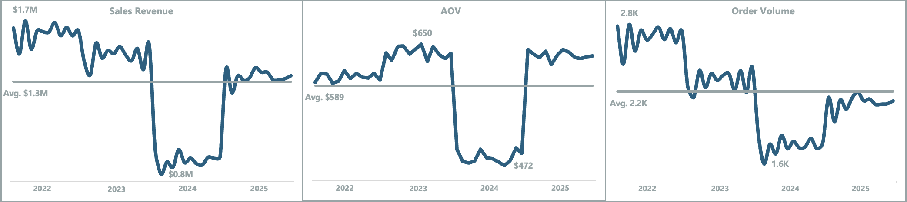

**2024 Was the Only Year All Three Core Metrics Contracted Simultaneously — Macro, Not Operational**
- Revenue, average order value (AOV), and order volume all hit four-year lows in 2024 — monthly revenue troughed at **$0.8M** against a **$1.3M** average, AOV compressed to **$472** against a **$589** average, and order volume bottomed at **1,641** against a **2,200** average.
- On an annual basis, revenue fell **42%** from **$17.8M** to **$10.4M**, AOV dropped **24** from **$638** to **$484**, and order volume declined 23% from **27,859** to **21,483** — uniform across all 10 products, all 4 regions, and all 4 quarters, confirming the cause was economic, not operational.
- Every other year had at least one offsetting metric: 2023 saw AOV rise **6%** despite order volume falling **13%** — pricing power absorbed weaker demand. In 2024, there was no such offset.

**Revenue Rebounded 56% in 2025 — But All Three Metrics Remain Below Their Four-Year Averages**
- Revenue rebounded **56%** to **$16.3M**, and AOV strengthened to **$634** — matching 2023 inflation-era highs, with the 2024→2025 Q4→Q1 transition producing a **+45.6%** revenue jump, the strongest positive quarterly transition.
- Order volume recovered to **25,687**, yet all three metrics remain below their four-year averages — the business is trending in the right direction, but hasn't returned to where it was before 2024.
- AOV's recovery to $634 is the strongest signal — customers returning in 2025 are spending at 2023 levels, confirming that loyalty expansion brought back higher-value buyers rather than discount-driven volume.

**January Functions as a Macro Leading Indicator — Monthly Variation Is Noise**
- January year-over-year performance predicted full-year outcomes without exception: a strong 2022 open, a modest 2023 dip, a simultaneous three-metric decline in 2024, and a sharp 2025 recovery — each accurately signaling the full-year outcome from the outset.
- Outside of January, month-over-month revenue averaged just **3%**, and AOV averaged **5%** across the remaining 11 months — single-month variance below those thresholds should not trigger strategic intervention.
- A formal January review costs nothing and gives operations its earliest possible signal before the year's trajectory is locked in.

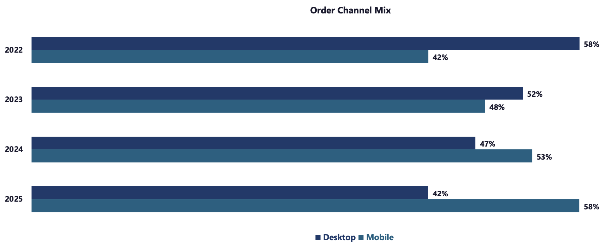

**Mobile Overtook Desktop in 2024 and Widened Its Lead in 2025 — A Four-Year Channel Reversal**
- Desktop held **58%** of order volume in 2022; by 2025, mobile reached **58%** — a precise four-year inversion. The shift was progressive: desktop maintained a majority share through 2023 (52/48) before mobile crossed over in **2024** (53/47) and widened its lead in 2025 (58/42).
- The marketing channel mix was flat across all four years — social media anchored **~46%** of orders as the dominant acquisition channel, while email served as the primary retention and lifecycle channel throughout.
- With mobile now driving the majority of transactions, checkout flow, payment experience, and page performance are baseline operational requirements — any friction directly impacts the majority of revenue.

### Product Performance

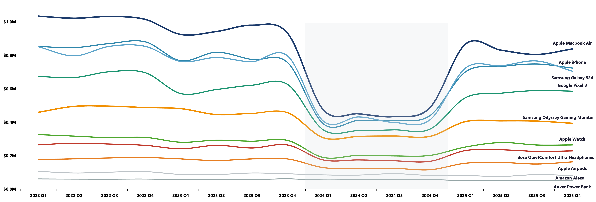

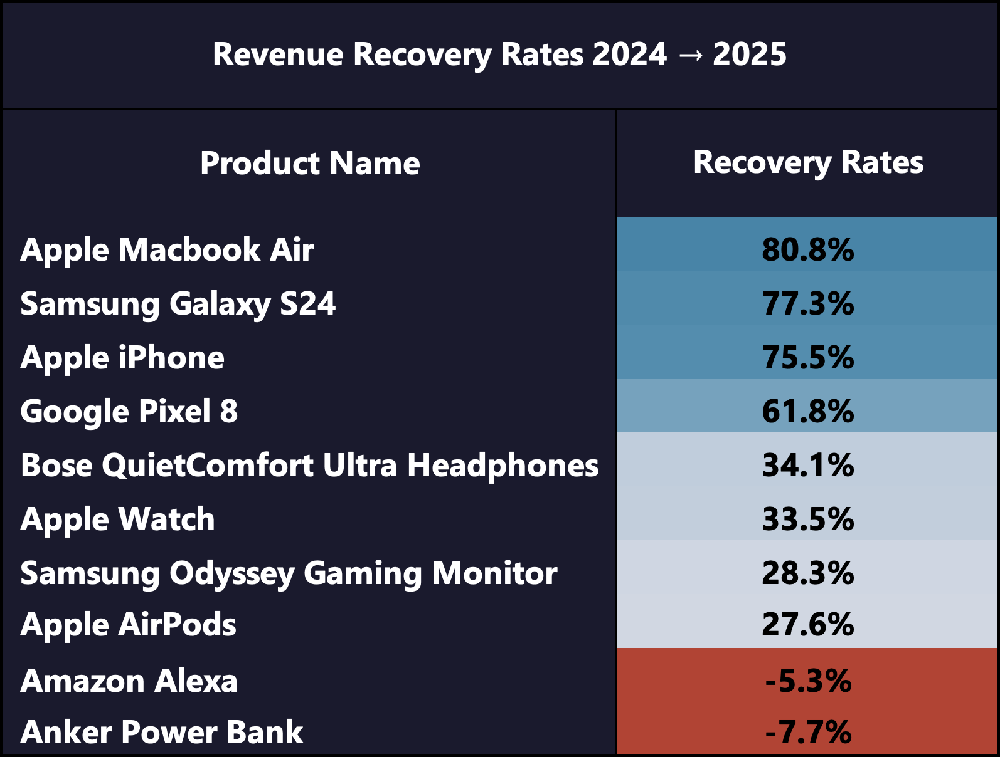

**MacBook Air Anchors Revenue — The Product Hierarchy Held Through Every Market Condition**
- MacBook Air generated **20-21%** of total revenue consistently across all 4 years, all 4 regions, and every market condition — no other product line approaches this revenue concentration.
- The premium tier led the 2025 recovery — MacBook Air (**+80.8%**), Samsung Galaxy S24 (**+77.3%**), and iPhone (**+75.5%**) posted the three highest recovery rates in the catalog, with collective premium AOV rebounding from **$773** in 2024 to **$1,107** in 2025, a **43%** recovery across the tier.
- Amazon Alexa and Anker Power Bank were the only two products that declined in 2025 — their 2024 trade-down gains reversed as customers returned to premium purchases.

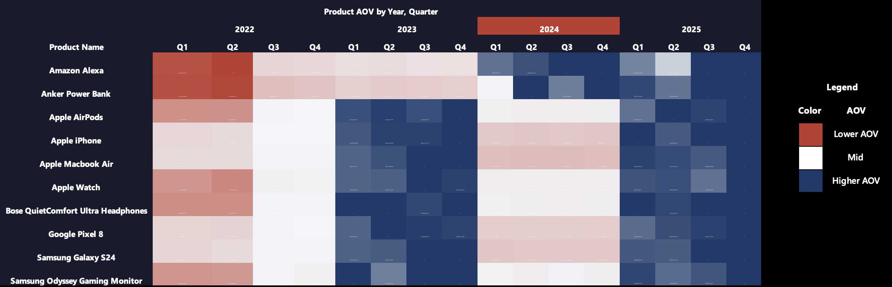

*Note: each row is scaled to that product's own four-year range — color intensity reflects relative performance within each product line, not absolute AOV comparisons across products*

**AOV Compression in 2024 Was Catalog-Wide — With One Notable Exception Among Budget Product Lines**
- Premium and mid-tier products compressed to four-year AOV lows in 2024, recovering uniformly in 2025 — budget products (Amazon Alexa, Anker Power Bank) ran counter to this trend, likely reflecting a shift toward lower-cost alternatives during the downturn, a pattern that normalized in 2025 as customers returned to premium purchases.
- Premium devices compressed furthest in absolute dollars and rebounded the strongest — confirming that product mix shifts in 2024 were macro-driven, not a structural shift in customer preferences.
- Overall portfolio AOV recovered to **$634** in 2025 — matching the Sales Performance findings and within **$4** of 2023's **$638** high — confirming returning customers are back to purchasing at full premium price points, not trading down.

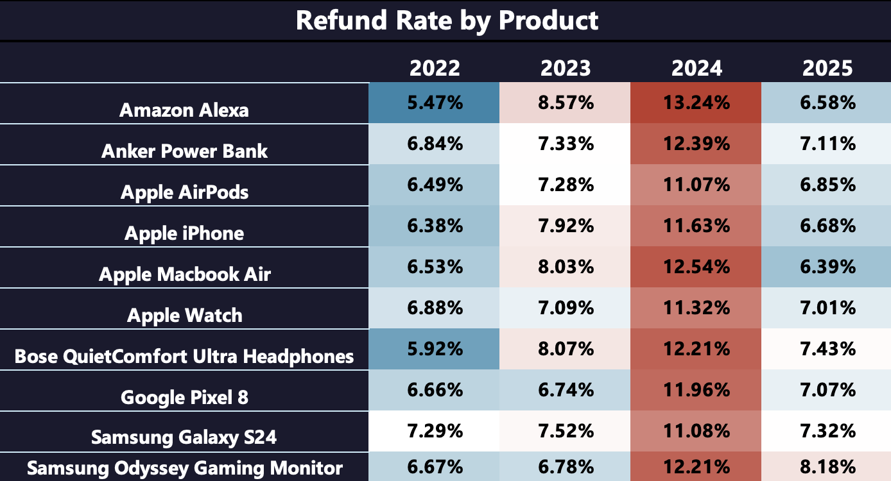

**The 2024 Refund Spike Was Systemic — Every Product Crossed 10% Simultaneously**
- The overall refund rate rose from **6.5%** in 2022, peaked at **12.0%** in 2024, and fell back to **7.1%** in 2025 — nearly doubling from 2022 before almost fully reversing by 2025.
- Every product breached the 10% refund threshold simultaneously in 2024 — Amazon Alexa peaked at **13.2%**, MacBook Air at **12.5%**, and Anker Power Bank at **12.4%** — no product was insulated from the spike, regardless of tier or category.
- A product quality or operational failure would surface through specific product lines — a simultaneous breach across every price tier in the same year points to customers pulling back financially, not a product or operations problem — and the 2025 return to near-baseline rates confirms the cause was cyclical, not structural.

### Customer Loyalty

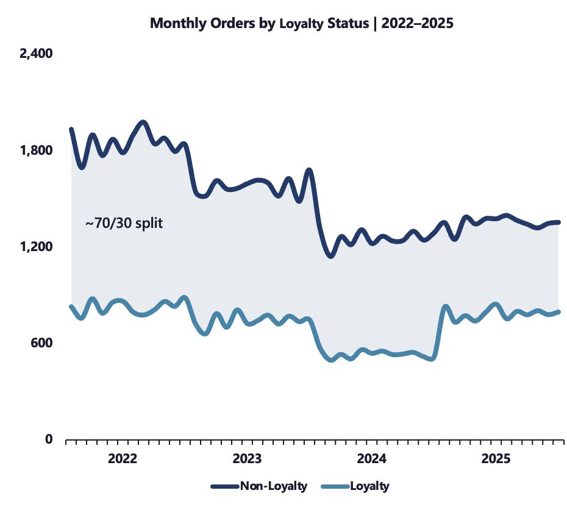

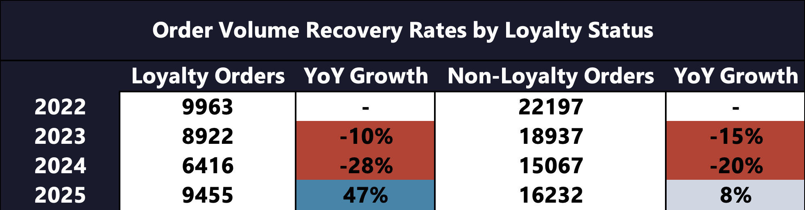

**The Loyalty Program Did Not Prevent the 2024 Contraction — It Determined Who Came Back**
- Both loyalty and non-loyalty order volumes compressed in 2024 — loyalty fell **28%**, non-loyalty fell **20%** — macro pressure did not discriminate by enrollment status.
- Divergence emerged in 2025 — loyalty order volume surged **47%** from **6,416** to **9,455**, nearly matching the 2022 baseline of **9,963** in a single year — non-loyalty orders recovered just **8%**, still well below their 2022 peak of **22,197**
- On a revenue basis, loyalty member sales recovered **93%** from their 2024 low versus just **39%** for non-members — the program's value is not preventing downturns, it is determining who returns when conditions improve.

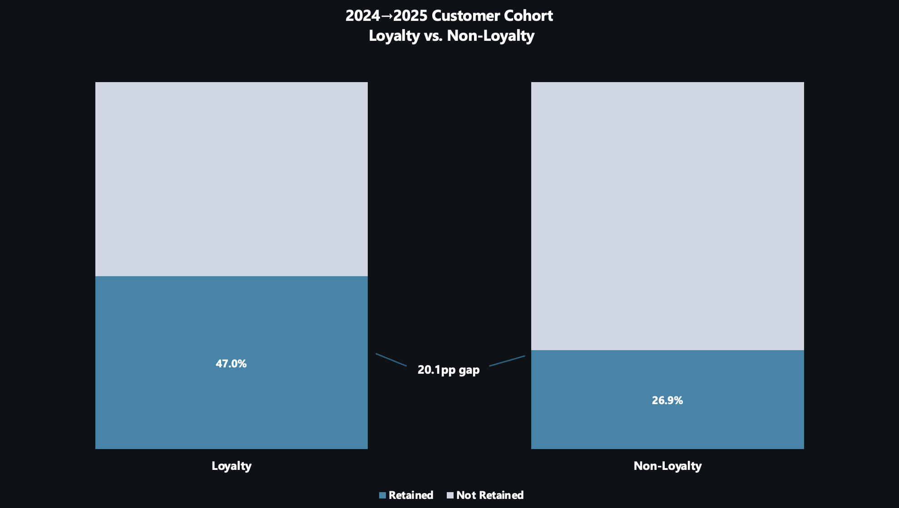

**Loyalty Members Retained at Nearly Twice the Rate of Non-Members**
- Of **12,076** non-loyalty customers active in 2024, only **3,253** returned in 2025 — **8,823** were lost at a **27.0%** retention rate versus **47.0%** for loyalty members, a 20.1 percentage point gap.
- Each converted non-loyalty customer represents **~$872** in incremental annual revenue — **8,823** lost customers represent a **~$7.7M** addressable opportunity.
- These **8,823** customers already know Venturo — re-engaging them costs less than acquiring new ones, and loyalty enrollment gives them a reason to stay.

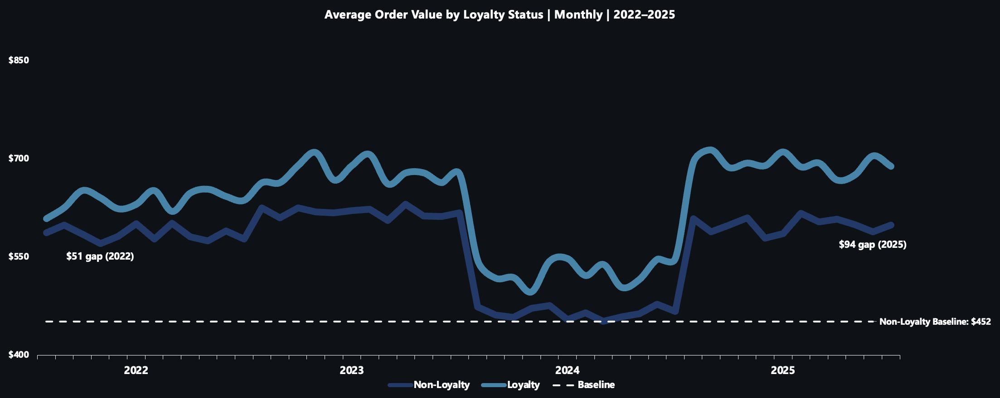

**The Loyalty AOV Premium Is Widening — Membership Compounds Spending Behavior Over Time**
- Loyalty members command a **$67** AOV premium over non-members — a gap that grew from **$51** in 2022 to **$94** in 2025, persisting through the 2024 compression and widening post-recovery.
- Higher spend per order combined with **2.90** orders per customer versus **1.88** for non-members, drove loyalty revenue share from **32.8%** in 2022 to **40.2%** in 2025 — the program is growing its share of Venturo's revenue while the overall customer base has yet to fully recover.

**EMEA Has the Largest Enrollment Gap — And the Weakest Recovery to Match**
- Loyalty adoption grew across all four regions between 2022 and 2025 — yet EMEA only narrowed the gap with NA from **18.5** percentage points in 2022 to **12.5** percentage points in 2025, the slowest closing rate of any region and the largest remaining enrollment gap.
- Every region that entered 2025 with higher adoption recovered faster — closing EMEA's **12.5** percentage point gap is the most valuable enrollment opportunity available, and four years of regional data make the directional case.

### Regional Performance

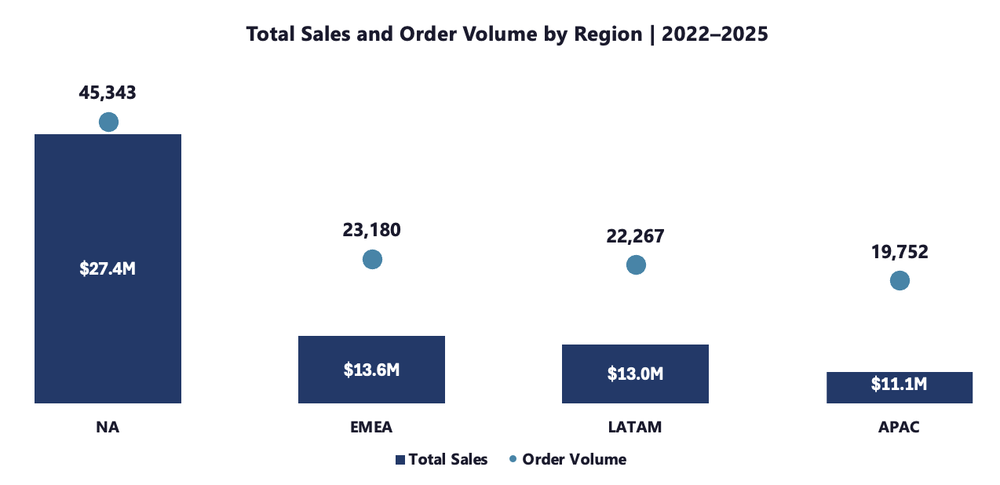

**NA Dominates Volume — Regional AOV Is Tightly Clustered, Making This a Volume Problem, Not a Pricing Problem**
- NA generated **$27.4M** across **45,343** orders — roughly double any other region — while EMEA (**$13.6M**), LATAM (**$13.0M**), and APAC (**$11.7M**) contribute nearly equally across **23,180**, **22,267**, and **19,752** orders, respectively.
- Despite the volume gap, regional AOV clusters tightly — NA **$605**, EMEA **$588**, APAC **$592**, LATAM **$584** — a **$21** spread across four global regions. The performance gap is a volume problem, not a pricing one — the path to closing it runs through loyalty enrollment and fulfillment improvement, not discounting.

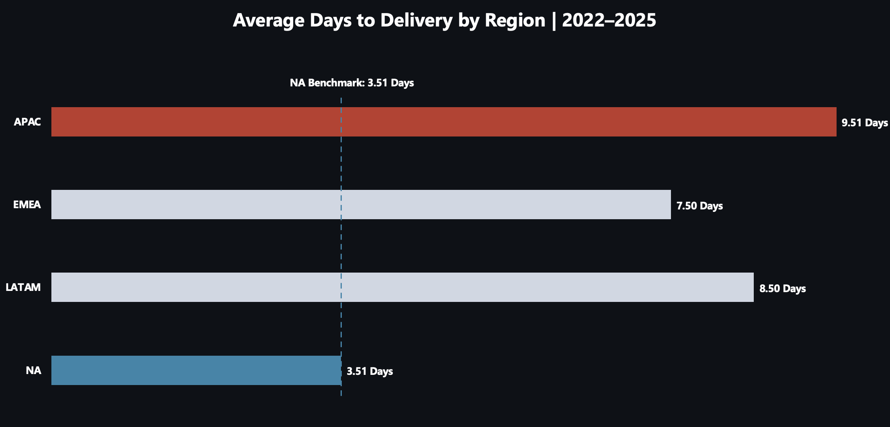

- APAC averages **9.51** days to delivery, versus NA's **3.51-day benchmark** — **171%** longer — with LATAM (**8.50** days) and EMEA (**7.50 days**) also significantly trailing.
- APAC posted the second-lowest recovery rate in 2025 at **55%** — with the longest delivery times and the second-lowest loyalty adoption at **34.4%**. Faster delivery is the most direct fix available to improve APAC's standing.

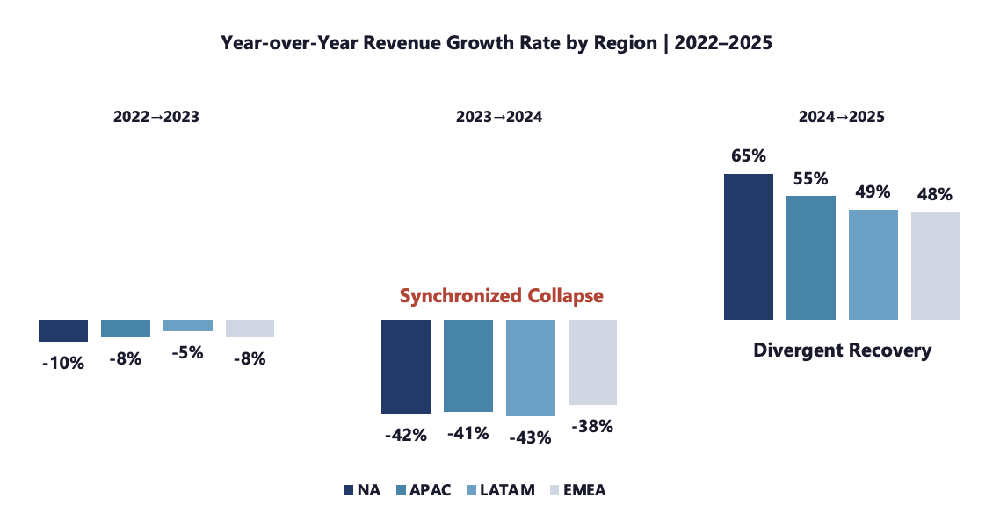

**All Four Regions Collapsed Together in 2024 — Recovery Diverged, With Loyalty Adoption as the Strongest Directional Indicator**
- Every region fell between **38%** and **43%** in 2024 — a synchronized contraction confirming the downturn was global, not regional.
- NA entered 2025 with the highest loyalty adoption (**41.7%**) and led recovery at **65%** — EMEA entered with the lowest adoption (**29.2%**) and posted the weakest recovery at **48%**, a pattern that holds at both ends of the spectrum.
- APAC and LATAM sit between these extremes with recoveries of **55%** and **49%** respectively — loyalty adoption is the strongest directional indicator of recovery performance, though not the only factor at play.

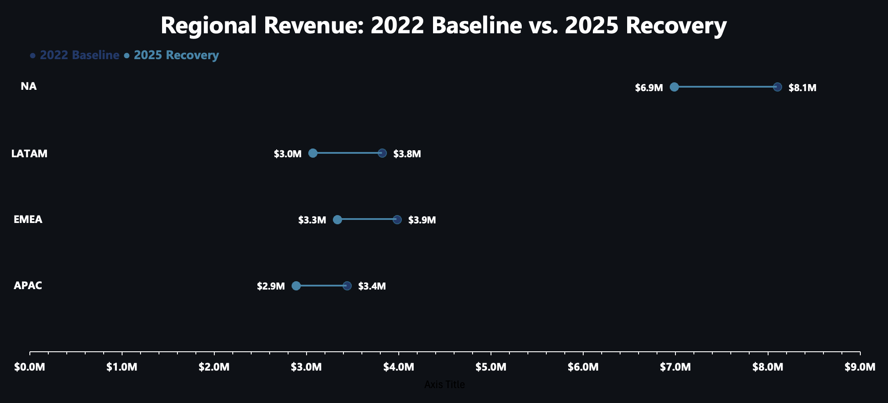

**Every Region Recovered Ground in 2025 — None Have Fully Returned to 2022 Baseline**
- NA recovered to **$6.9M** against an **$8.1M** baseline (**-13.8%**), EMEA to **$3.3M** against **$3.9M** (**-16.3%**), APAC to **$2.9M** against **$3.4M** (**-16.0%**), and LATAM to **$3.0M** against **$3.8M**(**-19.7%**) — every region remains below pre-compression levels
- NA is a different scale of business entirely — its **$1.2M** absolute gap is proportionally the smallest shortfall at **-13.8%**, while LATAM's **-19.7%** represents the deepest percentage gap of any region heading into 2026.
- Across all four regions, the path back to 2022 revenue levels runs through the same place — growing loyalty enrollment where it lags most.

## Recommendations

### Sales Performance 

**Formalize January as a Demand Planning Leading Indicator**
- January predicted full-year outcomes without exception across all four years — a simultaneous decline across revenue, AOV, and order volume in January should trigger an inventory and resource review before Q2 commitments are locked in.
- Outside of January, month-over-month variance below **3%** revenue and **5%** AOV does not warrant intervention — January is the signal, everything else is noise.

**Optimize the Mobile Checkout Experience**
- Mobile reached **58%** of order volume in 2025 — desktop is now the minority channel, meaning checkout friction, slow load times, and poor payment experience are actively costing revenue, not just limiting growth.
- Mobile checkout flow, payment experience, and page load performance are the minimum requirements for a business where mobile drives the majority of transactions.

**Monitor AOV as a Macro Sentiment Indicator**
- AOV compressed **24%** from **$638** to **$484** in 2024 before the full revenue collapse was visible — it is a leading signal of demand distress, not a lagging one.
- Set a monthly AOV floor at **$589** - two consecutive months below this threshold should trigger a demand and pricing review, independent of revenue performance.

### Product Performance 

**Protect MacBook Air as the Revenue Anchor**
- MacBook Air has consistently accounted for 20-21% of total revenue across all four years, all four regions, and every market condition — no other product carries this level of concentration or risk.
- Supply, pricing, and promotional decisions for MacBook Air should be treated as portfolio-level decisions - there is no product that can absorb the revenue impact if this anchor underperforms.

**Prioritize Premium Tier Inventory During Recovery Cycles**
- MacBook Air, Samsung Galaxy S24, and iPhone posted the three highest recovery rates in the catalog (+80.8%, +77.3%, +75.5%) — Alexa and Anker were the only two that declined. Budget gains during downturns reverse when conditions improve.
- When macro conditions show signs of recovery, skew inventory and marketing investment toward the premium tier - that is where lasting revenue growth comes from.

**Treat Refund Rate as an Early Warning Indicator**
- The overall refund rate climbed from 6.5% in 2022 to 12.0% in 2024 — breaching the 10% threshold across all 10 products simultaneously before the revenue collapse was fully visible in quarterly reports.
- A simultaneous multi-product breach above 10% should prompt an immediate demand and pricing review — it signals customers pulling back financially before the revenue impact shows up.

### Customer Loyalty

**Accelerate Loyalty Enrollment — Prioritize EMEA**
- EMEA's **29.2%** adoption rate trails NA's **41.7%** by **12.5** percentage points — every region that entered 2025 with higher adoption recovered faster, and EMEA has the most ground to close. 
- Loyalty members retained at **47.0%** versus **27.0%** for non-members — Closing the EMEA enrollment gap is the single most valuable intervention available heading into 2026.

**Re-Engage the 8,823 Lost Non-Loyalty Customers**
- Of **12,076** non-loyalty customers active in 2024, **8,823** did not return in 2025 — each conversion represents **~$872** in incremental annual revenue, making this a **~$7.7M** addressable opportunity.
- The customers exist, the dollar value is known, the action is straightforward — a re-engagement campaign with loyalty enrollment incentives directly targets this recoverable opportunity.

**Invest in Loyalty Program Maturation to Maximize Compounding Returns**
- The loyalty AOV premium grew from **$51** in 2022 to **$94** in 2025 — the longer a customer remains enrolled, the more their spending diverges from non-members.
- Acquisition campaigns should lead with loyalty enrollment as the primary offer - earlier enrollment means a longer compounding period and a higher lifetime revenue contribution per customer.

### Regional Performance 

**Close APAC's Fulfillment Gap**
- APAC averages **9.51** days to delivery versus NA's **3.51**-day benchmark — **171%** longer, directly correlating with APAC's second-lowest recovery rate of **55%** in 2025.
- Reducing APAC delivery times to within EMEA's **7.50**-day benchmark removes the most identifiable operational barrier in the region — with the longest delivery times and second-lowest recovery rate of **55%**, fulfillment speed is the clearest friction point within Venturo's direct control.

**Resolve the Marketing Attribution Gap**
- **15%** of orders (**~16,129**) carry an ‘Unknown’ marketing channel - without knowing how these customers were acquired, Venturo cannot evaluate which channels are working or where acquisition spend is being wasted.
- This is a data and engineering fix - until every order can be tied to the channel that drove it, Venturo is making acquisition decisions with incomplete information.

**Implement a Mobile-First Strategy for LATAM and APAC**
- Customers in LATAM and APAC are already buying on mobile - these two regions also sit furthest below their 2022 baselines at  **-19.7%** and **-16.0%**, respectively.
- Removing friction from mobile checkout, building mobile-specific loyalty enrollment flows, and concentrating social media acquisition spend in these markets targets the channel customers are already using in the markets with the largest revenue gap.

## Caveats & Assumptions 

### Data Cleaning & Preparation 

*Date Standardization*
- `order_ts`, `ship_ts`, `delivery_ts`, and `refund_ts` contained inconsistent date formats across 34,000+ rows — all standardized to a uniform M/D/YY format prior to analysis.
- 3,353 records contained NULL values under `order_ts` — retained as-is and excluded from all time-series analysis, as reliable imputation was not possible without risking inaccurate data.

*Product Data*
- Product names were inconsistently formatted across 26,840 rows — standardized via a product lookup table mapping raw entries to canonical names.
- `product_id` values were not validated against `product_name` in the source system — all mismatched pairs were identified and corrected via cross-reference against the product lookup table.

*Retained Limitations*
- `marketing_channel` contains an 'Unknown' category representing **15%** of records (**~16,129 orders**) — a system-assigned value where the pipeline failed to match the order to a known acquisition channel. Re-categorization is not feasible without source system logs.
- `account_creation_method` contains an 'Unknown' category representing **17%** of records (**~19,139**) — reflecting edge cases where the creation method was unloggable. Accepted as a valid category with the caveat that how customers create accounts may be underepresented in any channel-level analysis.

*Regional & Country Data*
- `country_code` entries were remapped to ISO 3166-1 alpha-2 standard across 14,433 rows — resolving all non-conforming alpha-3 format entries via the country lookup table.
- Region values containing casing and spacing variants were standardized across 13,568 rows to canonical formatting.

*Self-Generated Columns*
- Nine columns were derived from `order_ts` — including `order_year`, `order_quarter`, `order_month`, `order_season`, and `days_till_delivery` — enabling all time-series, seasonal, and fulfillment analysis performed throughout this report.

### Analytical Assumptions
- All year-over-year, seasonal, and monthly figures reflect the filtered dataset of **$63.8M** across **~51,026 customers** — excluding **3,353** records with missing order timestamps accounts for the **~$1.9M** discrepancy between the full data ($65M, ~52,000 customers) and filtered analysis.
- The customer retention rate analysis reflects a single cohort (2024→2025) — a point-in-time measure that should not be extrapolated as a multi-year retention trend.
- The correlation between loyalty adoption rate and regional recovery rate is directional, not causal — fulfillment performance, product mix, and regional macroeconomic conditions may also contribute to recovery rate differences and have not been fully isolated.
- The macro narrative is inferred entirely from internal data patterns — external economic indicators were not incorporated and have not been validated against the findings presented here.

### Visualization Notes
- Chart 7A (Product AOV Heatmap) uses row-level scaling — color intensity reflects each product's performance relative to its own four-year range, not absolute AOV comparisons across products.
- The three-chart Sales Performance panel displays monthly figures — trough values ($0.8M revenue, **$472** AOV, **1,641** order volume) represent monthly lows, not annual totals. Annual figures are sourced separately from the yearly growth rate analysis.

